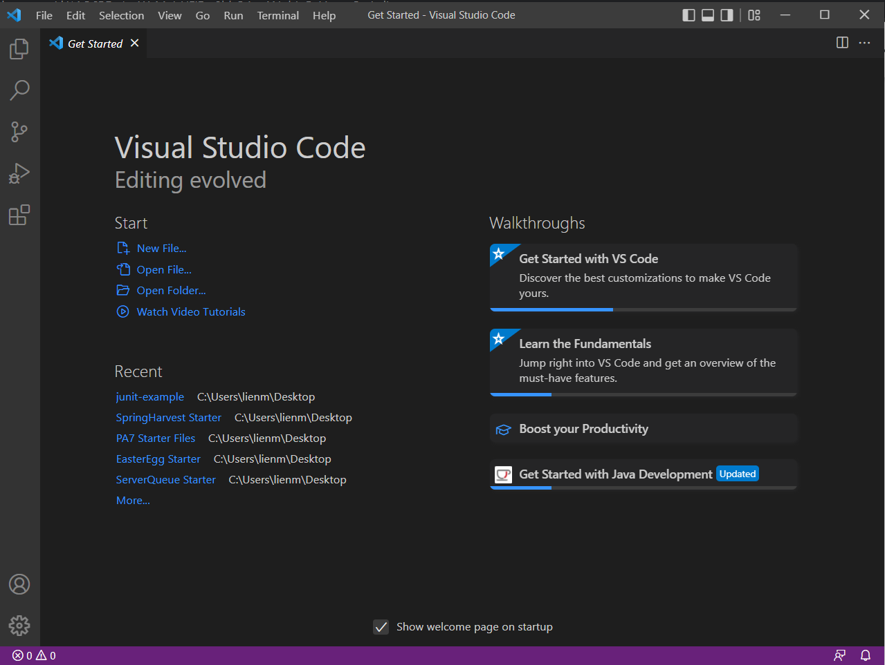
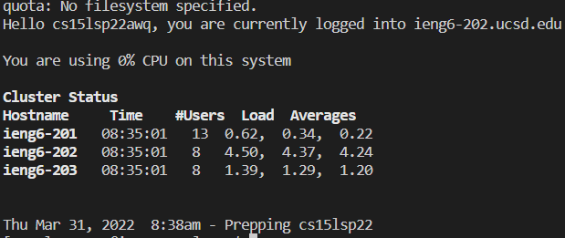
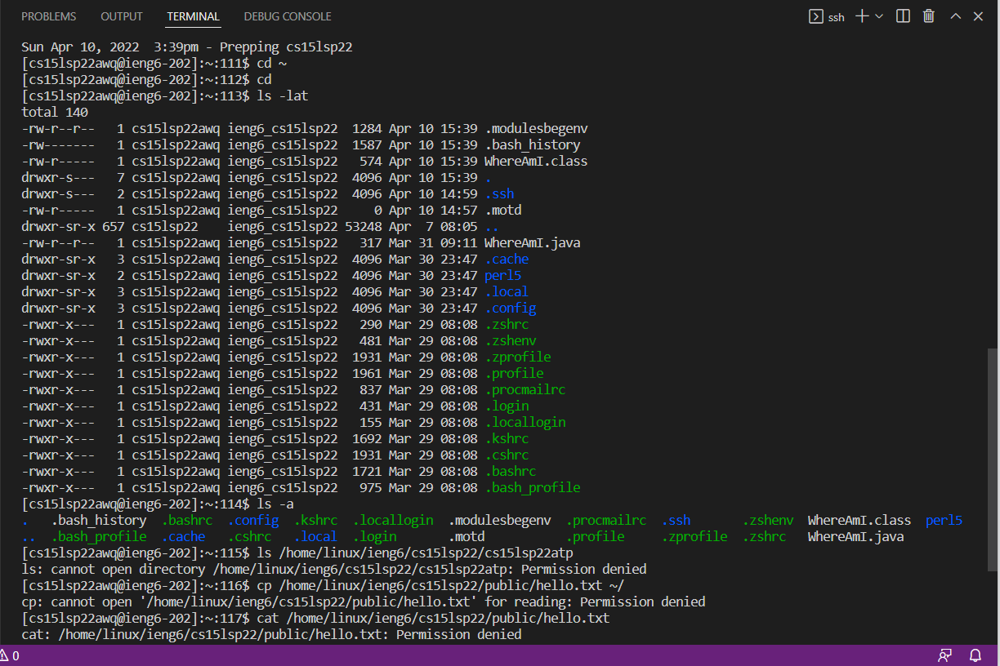
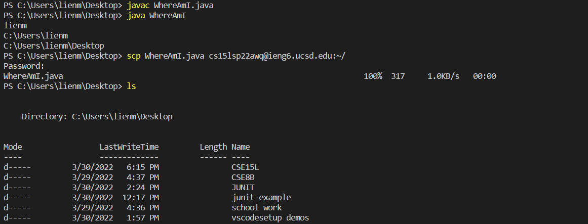
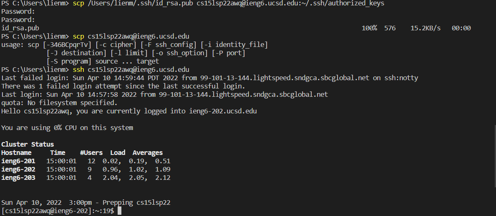
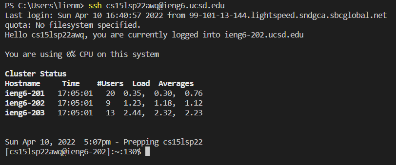
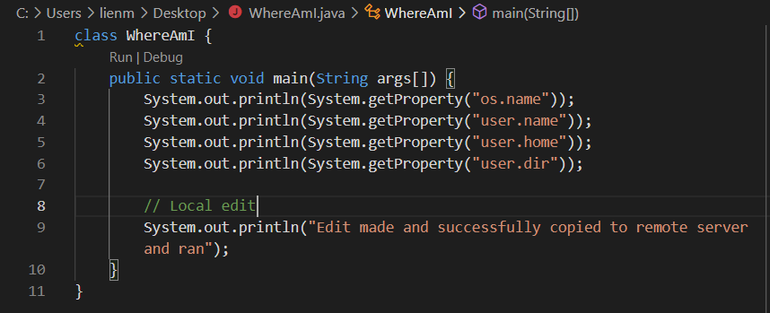
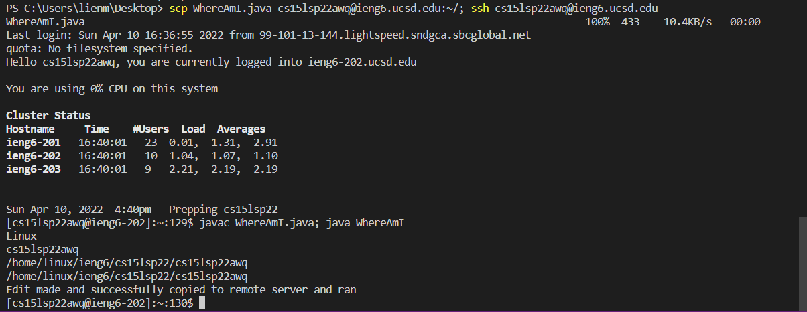

[Back to Home](https://smhitle.github.io/cse15l-lab-reports/)

# Installing VSCode

### Here lies a screenshot of VSCode when first opened. This step was pretty much just installing and setting up VSCode (which it may be already for some people). 

# Remotely Connecting

### This step utilizes the terminal in VSCode to use remote access.

**Note** If you don't have OpenSSH already on your computer, you should download it before doing this step. Otherwise you can't connect to the server.

Using the terminal in VSCode, we can connect remotely. After looking up your specfic course account for CSE 15L, use the command ssh. Specifically

`ssh cs15lsp22abc@ieng6.ucsd.edu`

and as a first time you will need to type *yes* into the terminal when connecting for the first time.

When this command is successfully ran, the terminal is connected to a remote computer located in The Basement. You can now run commands on that remote computer!

# Trying Some Commands

### The point of this step was to explore some useful commands in the terminal. The following are some listed commands that were tried, though some had failed. Some of these were useful in learning about remote access and copying files, and some were interesting to learn about.

cd ~ - changes directory to "~"

cd - changes the directory

ls - prints out the contents of a directory

ls -lat - combines the effects of -l, -a, and -t (long format, ".", and modification date)

ls -a - lists files including those starting with "." (these same files can be seen far left when the -lat command was run)

ls /home/linux/ieng6/cs15lsp22/cs15lsp22abc - should have theoretically listed the contents of another users directory, however, permission was denied

cp /home/linux/ieng6/cs15lsp22/public/hello.txt ~/ - permission denied

cat /home/linux/ieng6/cs15lsp22/public/hello.txt - permission denied

scp - securely copies a file(s) to the remote computer and is always run from the client

cp - does the same as scp, except for the fact that it does not utilize SSH

mkdir - makes a new directory

pwd - prints the working directory

# Moving Files with scp

### Using the command *scp* we can copy files from our computer to a remote computer. This command will be run on the client/local computer.

You can make a file, whether it contains code or not, and copy it to the remote computer. The command

`scp <file name> cs15lsp22abc@ieng.ucsd.edu`

where abc is your username, and this will copy that file to a directory on the remote computer.

# Setting up an SSH key

### Having to enter in a password everytime you connect remotely is kind of pain. Luckily in this step we learn how to set up ssh keys, which creates a public key and private key. These are copied copied onto the server and client respectively.

To create a ssh key, we will be using the command

`ssh-keygen`

creating the public and private key.

After this command is ran, choose a location to the save the keys to. The public and private keys will be located in there.

To copy the public key to the server, make a new directory in the remote computer

`mkdir .ssh`

You should now logout and copy the key using the scp command.

Once the public key is copied into the directory *.ssh*, we are able to use remote access commands (ssh and scp) without having to enter in a password

Now this is sick and convenient!

# Optimizing Remote Running

### There are some very convenient shortcuts that could be made when trying to work remotely. This example will focus on making a local edit on a file (WhereAmI.java) and copying it to the remote server and running it.

The first step is to make the local edit itself. The WhereAmI.java file will be edited with the addition of the following code on top of it's existing code, which will serve as the local edit.

`System.out.println("Edit made and successfully copied to remote server and ran")`

The second step is to copy it to the server, and conveniently, the SSH key we created in the last part helps a lot since no password is required.

There is also the fact that we are allowed to make up several commands in one line, in which the command I will be using is

`scp WhereAmI.java cs15lsp22awq@ieng6.ucsd.edu:~/; ssh cs15lsp22awq@ieng6.ucsd.edu`

and

`javac WhereAmI.java; java WhereAmI`

The reason the two lines are separated is because when running it all on the same line, it appears that compiling and running come after you exit the remote connection, doing it on the client instead. So in order for it to be run on the server, I decided to separate them.

Now let's see it in action.

Voila! The file compiled and ran successfully. 

