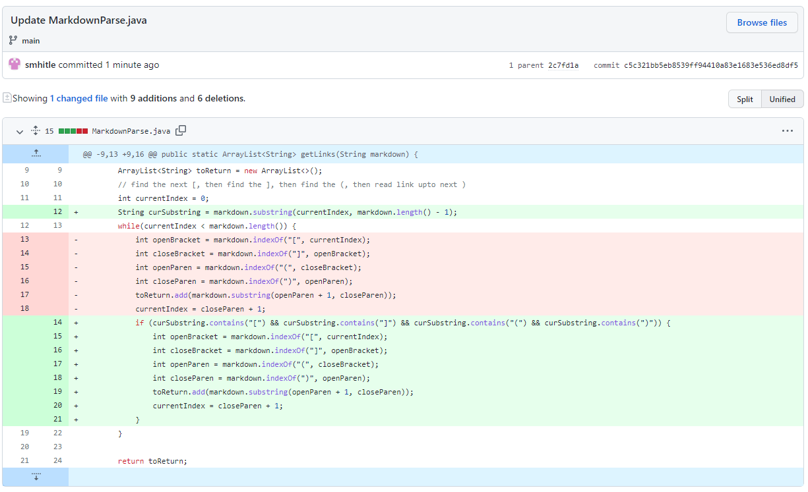

[Back to Home](https://smhitle.github.io/cse15l-lab-reports/)

# Lab 2

### When working with the MarkdownParse program there were several bugs that emerged as a result of testing it with different test cases. The bugs that were encountered, the symptoms that were shown and the changes to fix them can be seen below.

# Bug #1 

The first bug that I had encountered was having trouble with was checking the parentheses and brackets. An example of a test case :

[TestFile1](https://github.com/smhitle/markdown-parser/blob/main/file2.md?plain=1)

As we can see there are multiple valid links among a series of separated brackets and parentheses.

If we do not check and correctly take into account that there will be brackets and parentheses, where one of them might be missing, chances are high that we will encounter an infinite loop. This is because the original program had relied on using the index of the brackets/parentheses to break out of the while loop. If we check that there is indeed at least one of each, we will not experience this error.

# Bug #2

* During this process, a lot of infinite loops were encountered 😭

This next bug was related to having the "link" tags on two separate lines. For example this is the test file 

[TestFile2](https://github.com/smhitle/markdown-parser/blob/main/file3.md?plain=1)

The important thing to note in this test file is the separation of `[Link2]` and `(chickens.com)`. 

The second link is outputted, even though it should not be considered a valid link due to the separate between the tags. To fix this, we have to check line by line for the brackets and parentheses. We can do this via splitting each line of the file into an array and do the check.

# Bug #3

The last bug I encountered was having spaces in between the link tags. There was also another issue with spaces, where there would be spaces in between links, but fortunately this was solved in the last code change.

[TestFile3](https://github.com/smhitle/markdown-parser/blob/main/file4.md?plain=1)

The failing output resulted in the addition of a blank space.

Spaces inbetween either the brackets or parentheses should not be a valid link. If we did not take this into account, the results of the fail output of the test file is what would happen. Among the links collected when using the program, there would be multiple invalid links among valid links.

