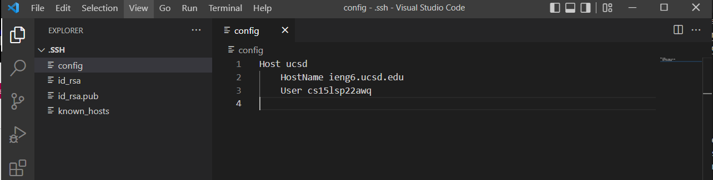
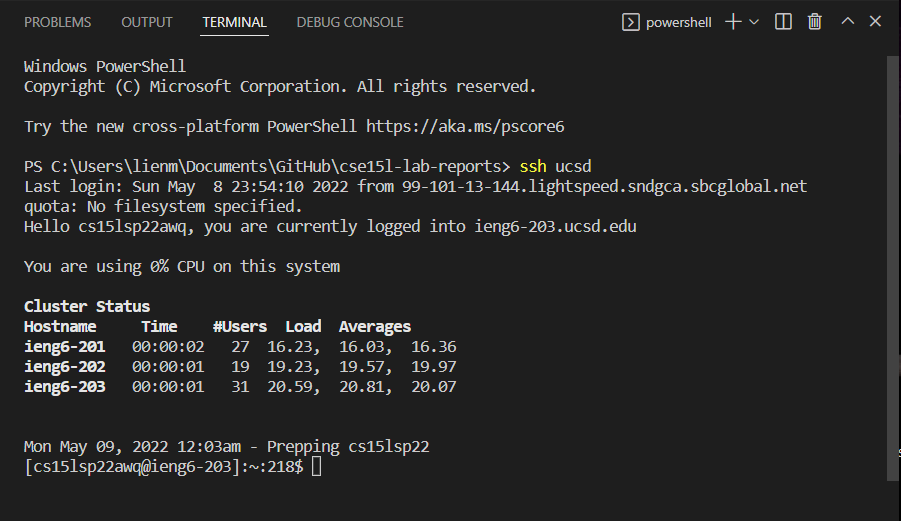
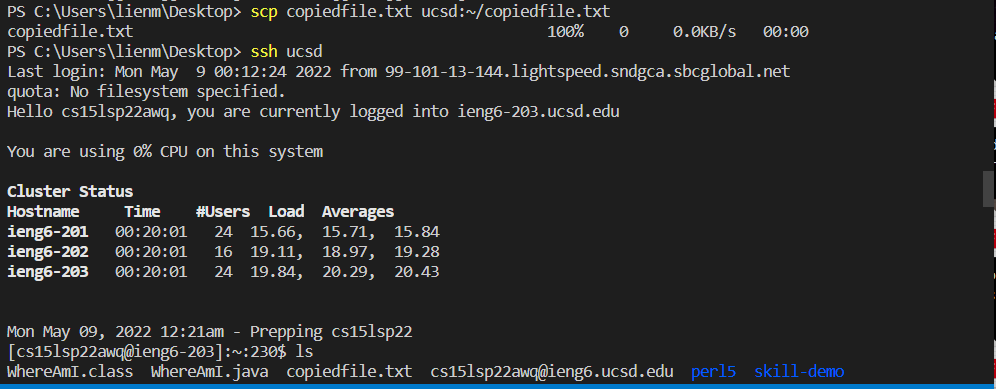
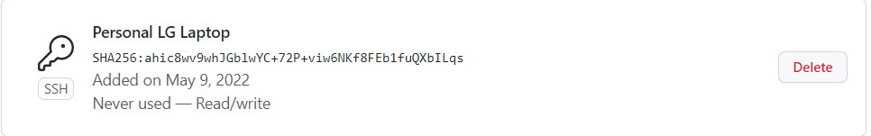
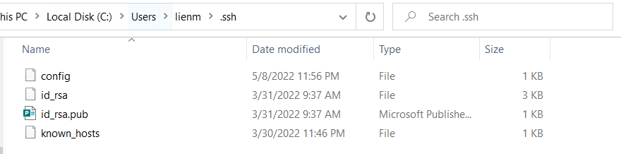
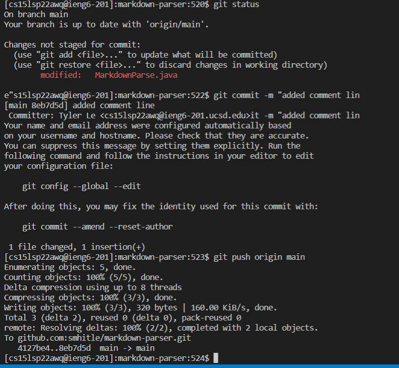
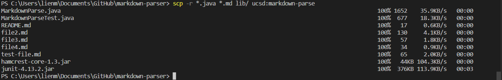
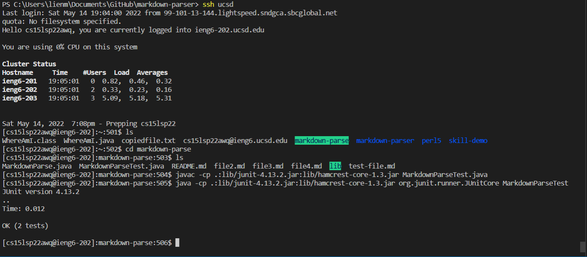
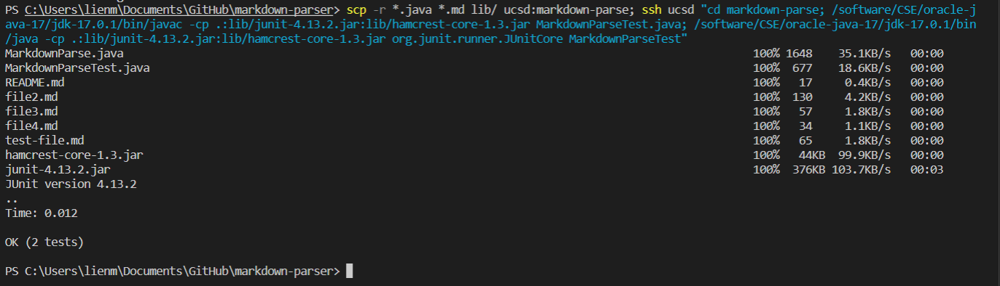

[Back to Home](https://smhitle.github.io/cse15l-lab-reports/)

# Lab Report 3

## Streamlining ssh Configuration

Initially I had to create a config file under the .ssh directory. Once it was created I opened a new window in VSCode in order to edit it (since it was uneditable unless I had a proper way to open it). 

Having it opened, I changed the name of the alias to ucsd instead. In order to access the ieng6 server, all I had to do was use ssh ucsd (very conveinent)

The next to do was copy a file using this new method. The command that I used to do this was `scp <filename> ucsd:~/<filename>`

## Setup Github Access from ieng6 

This is where the public key is stored (on GitHub)

This is where the private key is stored (local)

In order to test these keys, I logged onto the remote server and tried to commit and push a change, a simple addition of a comment line. In order to do this I cloned the repository onto the server and used my ssh link with the command `git remote set-url origin <url>` to commit and push.

The resulting commit can be seen here :

[Result](https://github.com/smhitle/markdown-parser/commit/8eb7d5d15ed1bab612c456dd0b0988fe4c1340df)

## Copy whole directories with `scp -r`

We can copy whole directories with `scp -r` and in this example I will be copying my entire MarkdownParse directory to the remote computer. In order to first copy I will be using the command

`scp -r *.java *.md lib/ ucsd:markdown-parse`

This initial command, selectively copies the desire files over.

Next is to make sure that the program is able to be compiled and ran successfully.

Now to make it even easier we can put all the commands onto one line for convenience, allowing us to copy the directory, log onto the remote server and compile and run our program there.

This requires a very long command as seen in the picture.

