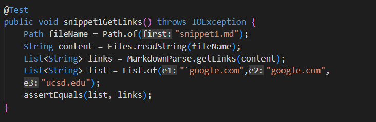
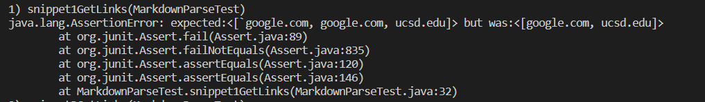
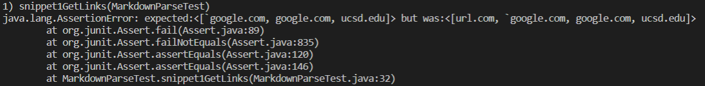
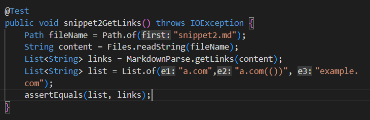
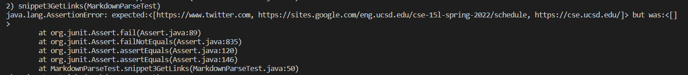
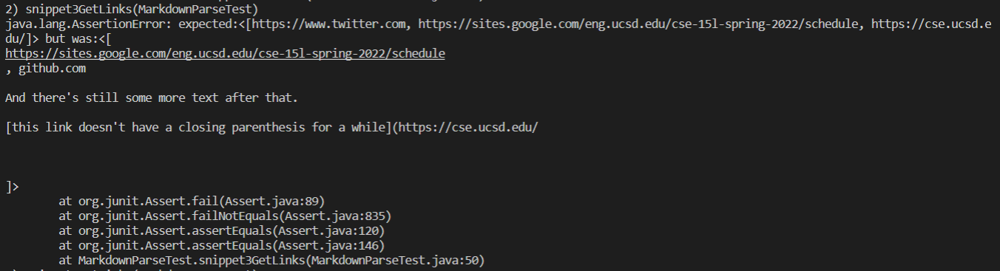
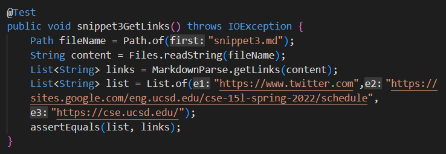
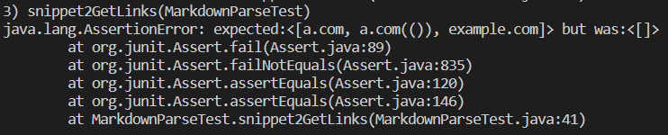
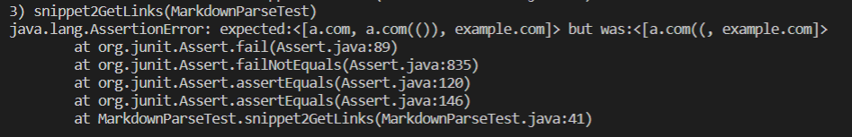

[Back to Home](https://smhitle.github.io/cse15l-lab-reports/)

# Lab Report 4

For this lab report, we have 3 snippets/test cases that we will be testing with two different versions of MarkdownParser, one being [mine](https://github.com/smhitle/markdown-parser) and the other being [the one I reviewed](https://github.com/MichaelYe48/markdown-parser). The tests that I wrote will be applied to both implementations.

## Snippet 1

From what the preview on VSCode showed, the expected links that should be valid are <code>[`google.com, google.com, ucsd.edu]</code>

The test that I wrote, for both my implementation and the other, was the following :

When running the test the following output resulted in

My implementation : Failed

Reviewed implementation : Failed

My implementation forms strings on a line by line basis, but it also immediately renders a string as an invalid link if it has a space. The first link should be valid, however, since there was a space between the brackets <code>[another link]</code>. Perhaps I could specify where that space would be, specifically between <code>[]</code> and <code>()</code>, in order to make it work, which should take less than 10 lines.

## Snippet 2

The expect output should be <code>[a.com, a.com(()), example.com]</code> according to the preview

The following image is the test that I wrote for this snippet

When running the test the following output resulted in

My implementation : Failed

Reviewed implementation : Failed

Once again since my code renders any spaces within the substring as an invalid link and so I would have to fix it by specifying where that space has to be in order to make the substring invalid, in between <code>[]</code> and <code>()</code>. I believe that this code change would take less than 10 lines since it just involves specifiying where the space has to be checked in order for the link to be invalid, similiar to the solution mentioned in snippet 1.

## Snippet 3

The expect output should be <code>[https://www.twitter.com, https://sites.google.com/eng.ucsd.edu/cse-15l-spring-2022/schedule, https://cse.ucsd.edu/]</code> according to the preview

The following image is the test that I wrote for this snippet

When running the test the following output resulted in

My implementation : Failed

Reviewed implementation : Failed

This snippet violates the line by line basis of my implementation due to each of the links covering separate lines. To fix this would require completely altering my code in a way that it wouldn't consider anything *inbetween* <code>[]</code> and <code>()</code> on a line by line basis. Also considering there are also spaces in the links, I would also have to account for that using the solution I had for the other two snippets, requiring more than ten lines of code to fix.

