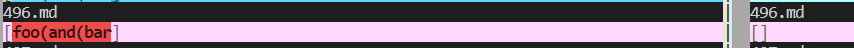

[Back to Home](https://smhitle.github.io/cse15l-lab-reports/)

# Lab Report 5

I used the `vimdiff` command to view the differences between the results of the outputs of my implementation and the original implementation. This was very convenient due to the many test cases and it would have been very hard to spot the differences between them.

The two test cases that I chose, **492 and 473**, can be found here : [Test Cases](https://github.com/smhitle/markdown-parser/tree/main/testfiles)

## Difference 1

For the first test case the expected output should be <code>[]</code>

My implementation's output : <code>[foo(and(bar]</code>

Orginal implementation's output : <code>[]</code>

For picture reference 

In this case the original implementation provided the correct output meaning that my implementation needs to be fixed somewhere. What I believe to wrong is the fact that my implementation returns the substring whatever is inbetween <code>()</code> given it meets the right conditions. It does not check for duplicate brackets within brackets of any type thus returning an invalid link.

The place that I believe that needs to be fixed spans across several lines as I expect that this change would likely require me to change quite a few lines. Here is where the change would likely take place :

This is a several line change as I would need to rework how the implementation tracks the brackets

## Difference 2

For the second test case the expected output should be <code>[/url]</code>

My implementation's output : <code>[]</code>

Orginal implementation's output : <code>[/uri]</code>

For picture reference 

Once again the original implementation provided the correct output. The problem with my implementation is that it does not account for spaces in between <code>[]</code> and <code>()</code>, making them invalid links if there is a space in the substring at all. 

The place that I believe that the change should take place would be here : 

Having the change here would allow spaces in specific areas, instead of having none of them at all and would be a multiline change.

